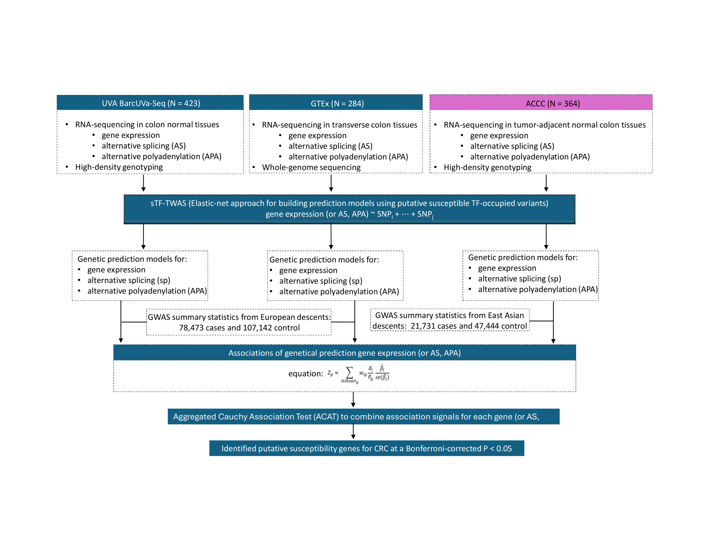

# sTF-TWAS-CRC

## Overview
In this work, we analyzed 218 TF chromatin immunoprecipitation sequencing (ChIP-Seq) datasets from colorectal cancer (CRC) related cells, along with GWAS data comprising 100,204 CRC cases and 154,587 controls of East Asian and European ancestries, using the generalized mixed models we developed. Under our sTF-TWAS framework, we performed trans-ancestry analyses to evaluate associations between genetically predicted gene expression, alternative splicing (AS), and alternative polyadenylation (APA) with CRC risk, using RNA-seq data generated in normal colon tissue samples obtained from 364 individuals of Asian-ancestry and 707 individuals of European-ancestry. Differential gene expression analyses across colon normal, adenoma and carcinoma tissues were conducted using single cell RNA-seq data from over 100 individuals. Gene functional validation was performed using CRISPR-Cas9 knockdown in CRC cell lines.

**Step1:** Identify the risk TFs for CRC.

**Step2:** Constructions of sTFTWAS models using gene expression, alternative splicing and Alternative polyadenylation (APA) for European ancestry and Asian ancestry.

**Step3:** Associations sTFTWAS models with colorectal cancer GWAS summary statistics from large population to identify risk proteins for CRC.

**Step4:** Differential expression analysis from single cell data

## Methods
### Identification of CRC risk TFs
We used our recently developed generalized mixed model approach7 to investigate associations of CRC risk with variations of TF-DNA binding by a single TF. Please refer to our previous publication [PMID: 34518541](https://pubmed.ncbi.nlm.nih.gov/34518541/) and github repository [BC-TFvariants](https://github.com/XingyiGuo/BC-TFvariants/) for more information.

### Constructions of sTFTWAS models
We utilized the weight matrix and the summary statistics from CRC GWAS datasets consisting of 186,072 individuals of European ancestry and 72,272 individuals of East Asian ancestry, we evaluated the association between gene expression (or AS, APA) and CRC risk under the sTF-TWAS framework.

Following [GTEx RNA-seq analyses pipelines](https://github.com/broadinstitute/gtex-pipeline), Events were quantile normalized and inverse normal transformed. The potential confounding factors (such as top five principal components (PCs), gender, potential batch effects, PEER factors) for events have been removed using [PEER](https://github.com/PMBio/peer).

For more information, please refer to our previous publication [PMID: 36402776](https://pubmed.ncbi.nlm.nih.gov/36402776/) and github repository [sTF-TWAS](https://github.com/XingyiGuo/TF-TWAS).

- Executive code:
1. run_expression_peer.R
2. sTFTWAS_models.R
3. buildDB.R

### Identification of CRC risk events through associations
We utilized the weight matrix and the summary statistics from CRC GWAS datasets consisting of 186,072 individuals of European ancestry and 72,272 individuals of East Asian ancestry, we evaluated the association between gene expression (or AS, APA) and CRC risk under the sTF-TWAS framework.

- Executive code: \
conda activate [spredixcan](https://github.com/hakyimlab/MetaXcan/blob/master/software/SPrediXcan.py) \
./path/to/src/MetaXcan/software/SPrediXcan.py --model_db_path model.db --covariance model_cov.txt.gz --gwas_folder ./GWAS_SS/ --gwas_file_pattern ".*gz" --snp_column SNP --effect_allele_column A1 --non_effect_allele_column A2 --beta_column BETA  --pvalue_column P --output_file  model.TWAS --verbosity 1

### Differential gene expression analysis from single cell data
We conducted differential expression analysis across colorectal cancer (CRC) developmental stages to identify key genes associated with tumorigenesis. Using a pseudobulk gene count matrix derived from single-cell RNA sequencing (scRNA-seq) data, we applied DESeq2 to detect differentially expressed genes between normal tissues and precancerous/cancerous stages along both the normal-serrated polyp-carcinoma and normal-adenoma-carcinoma pathways.

- Executive code:

### Data Availability
The GWAS summary statistics are available at the GWAS catalog under accession number GCST90129505 (https://www.ebi.ac.uk/gwas/studies/GCST90129505). The RNA-seq data and genotype data of subjects of East Asian ancestry from the ACCC is in the process of depositing to NCBI database of Genotypes and Phenotypes (dbGaP, accession number phs002813.v1.p1). The data from the Genotype-Tissue Expression (GTEx, version 8) project used in this study are publicly available at the dbGaP under accession number phs000424.v8.p2 (https://www.ncbi.nlm.nih.gov/projects/gap/cgi-bin/study.cgi?study_id=phs000424.v8.p2). The transcriptome and genotype data as well as the sample covariates from the BarcUVa-Seq project can be accessed at the dbGaP under accession number phs003338.v1.p1 (https://www.ncbi.nlm.nih.gov/projects/gap/cgi-bin/study.cgi?study_id=phs003338.v1.p1). Single-cell RNA-sequencing datasets from colon tissues of 31 individuals were obtained from the Colorectal Molecular Atlas Project (COLON MAP).

## Contact
Qing Li: qing.li@vumc.org \
Xingyi Guo: xingyi.guo@vumc.org
